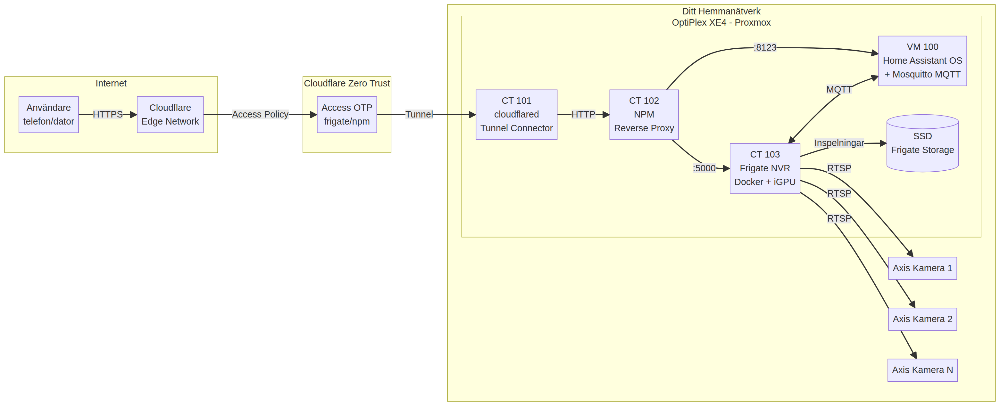

# OptiPlex Homelab

Detta repo innehåller en steg-för-steg-guide för att sätta upp en Dell OptiPlex XE4 (eller liknande Intel 12:e gen-maskin) som en kraftfull hemmaserver för **Home Assistant** och **AI-driven videoövervakning (Frigate NVR)**.

Guiden är skriven så att den fungerar för dig oavsett om du har tillgång till en AI-assistent (som Manus) eller följer stegen manuellt. Varje guide innehåller förklaringar av *varför* vi gör varje val, verifieringssteg så du vet att allt fungerar, och felsökningsavsnitt för vanliga problem.

## Arkitektur

Hela systemet bygger på principen att **ingen port öppnas i din router**. All extern åtkomst går via en krypterad Cloudflare Tunnel.



| Komponent | Roll | Varför just denna? |
|-----------|------|-------------------|
| **Proxmox VE** | Hypervisor (kör allt) | Gratis, industristandard, LXC + VM-stöd |
| **CT 101 — cloudflared** | Tunnel-connector | Utgående anslutning, ingen port forwarding |
| **CT 102 — NPM** | Reverse proxy | Klickbart GUI, wildcard-routing, WebSocket-stöd |
| **CT 103 — Frigate** | AI-videoövervakning | OpenVINO på iGPU, YOLOv9c, 16+ kameror |
| **VM 100 — Home Assistant** | Smart home-hub | HAOS med Add-ons (Mosquitto MQTT) |
| **Dedikerad SSD** | Frigate-inspelningar | Skyddar OS-disken från slitage |

## Komma igång

Följ guiderna i `docs/` i nummerordning. Om du har tillgång till Manus, börja med att läsa `docs/00-projektbeskrivning-manus.md` och klistra in den i ditt projekt.

### Guider (i ordning)

| # | Guide | Beskrivning |
|---|-------|-------------|
| 00 | [Manus-projektbeskrivning](docs/00-projektbeskrivning-manus.md) | Mall att klistra in i AI-assistenten (valfritt) |
| 00.5 | [Förberedelser](docs/00.5-forberedelser.md) | Allt du kan göra INNAN hårdvaran kommer |
| 01 | [BIOS-konfiguration](docs/01-bios-setup.md) | Virtualisering, iGPU, strömhantering |
| 02 | [Proxmox-installation](docs/02-proxmox-install.md) | OS-installation + post-install |
| 03 | [Lagringsdisk](docs/03-lagringsdisk.md) | Dedikerad disk för videoinspelningar |
| 03.5 | [Domän & Cloudflare](docs/03.5-doman-cloudflare.md) | Flytta/registrera domän hos Cloudflare |
| 04 | [Cloudflare Tunnel](docs/04-cloudflare-tunnel.md) | Säker extern åtkomst utan port forwarding |
| 05 | [Nginx Proxy Manager](docs/05-npm.md) | Reverse proxy med GUI |
| 06 | [Frigate NVR](docs/06-frigate.md) | AI-videoövervakning med iGPU |
| 07 | [Axis-kameror](docs/07-axis-kameror.md) | Dual stream-konfiguration |
| 08 | [Home Assistant](docs/08-home-assistant.md) | VM + migrering + MQTT |
| 09 | [Extern livevy](docs/09-extern-livevy.md) | MSE via tunnel (+ TURN som tillval) |
| 10 | [Cloudflare API Setup](docs/10-cloudflare-api-setup.md) | Konto, Loopia-flytt, Tunnel & API-nyckel |

### Referensmaterial

| Fil | Beskrivning |
|-----|-------------|
| [Kapacitetsplanering](docs/kapacitetsplanering.md) | RAM/CPU per antal kameror |
| [Backup-strategi](docs/backup-strategi.md) | Automatisk säkerhetskopiering |
| [Ordlista & FAQ](docs/ordlista-faq.md) | Termer förklarade i klartext |
| [SETUP-CHECKLIST](SETUP-CHECKLIST.md) | Avbockningsbar lista |
| [STATUS](STATUS.md) | Din live-status (fyll i vartefter) |

## Automatisk Installation Wizard

Istället för att följa guiderna steg-för-steg manuellt kan du använda vår interaktiva installer-wizard. Den hanterar hela uppsättningen åt dig.

### Funktioner

- **Progressbar** — Visar var du är i flödet (steg X/9)
- **Auto-nätverksdetektering** — Hittar gateway, prefix och DNS automatiskt
- **BIOS auto-konfiguration** — Ställer in 40+ BIOS-inställningar via Dell Command Configure
- **Resume-stöd** — Hoppar över steg som redan är klara vid nästa körning
- **Frigate config-generator** — Skapar komplett config.yml baserat på dina kameror
- **Google Gemini AI** — Valfritt steg för AI-genererade händelsebeskrivningar
- **Rollback** — Erbjuder att ångra halvfärdiga installationer vid fel
- **Dry-run mode** — Testa utan att ändra något: `bash setup.sh --dry-run`

### Installation (ett kommando)

```bash
# SSH:a in på din Proxmox-nod och kör:
bash <(curl -fsSL https://raw.githubusercontent.com/ToFinToFun/optiplex-homelab/master/scripts/bootstrap.sh)
```

Bootstrappern installerar eventuella saknade beroenden, laddar ner repot och startar wizarden automatiskt.

### Verktyg

| Kommando | Beskrivning |
|----------|-------------|
| `bash tools/doctor.sh` | Komplett diagnostik — kontrollerar iGPU, containers, Docker, tunnel, disk |
| `bash tools/status.sh` | Snabb statusöversikt för alla tjänster |
| `bash tools/usb-backup.sh` | Säkerhetskopia till USB (vzdump, exkl. Frigate-video) |
| `bash tools/update.sh` | Uppdaterar Proxmox + Docker-images |
| `bash tools/uninstall.sh` | Tar bort alla skapade containers/VMs rent |
| `bash tools/upgrade-proxmox.sh` | Uppgradera Proxmox 8 → 9 |
| `bash setup.sh --dry-run` | Visa vad som SKULLE hända utan att ändra något |

### Konfigurationsfiler

| Fil | Beskrivning |
|-----|-------------|
| [configs/frigate-config-template.yml](configs/frigate-config-template.yml) | Komplett Frigate-template (används av wizarden) |
| [configs/frigate-config.example.yml](configs/frigate-config.example.yml) | Frigate-exempelconfig med kommentarer |
| [configs/docker-compose-frigate.yml](configs/docker-compose-frigate.yml) | Docker Compose för Frigate (host network, .env) |
| [configs/docker-compose-npm.yml](configs/docker-compose-npm.yml) | Docker Compose för NPM |
| [scripts/axis-create-stream-profiles.sh](scripts/axis-create-stream-profiles.sh) | Automatisera Axis-kamerakonfiguration |
| [scripts/proxmox-post-install.sh](scripts/proxmox-post-install.sh) | Byt repos + aktivera TRIM |
| [configs/99-igpu-permissions.rules](configs/99-igpu-permissions.rules) | udev-regel för iGPU (överlever reboot) |

## Frigate Config Generator

Modul 06 i wizarden genererar en **komplett Frigate config.yml** baserat på:

1. **Nätverksskanning** — Hittar Axis-kameror automatiskt (eller manuell inmatning)
2. **Interaktiv namngivning** — Ge varje kamera ett vettigt namn
3. **Multi-channel stöd** — Axis-kameror med flera linser (t.ex. P3265-LVE)
4. **Beprövad bas-template** — 2x OpenVINO GPU, YOLOv9c, VAAPI, semantic search
5. **Google Gemini AI** — Valfritt steg för AI-beskrivningar
6. **Environment-variabler** — Inga lösenord i YAML (allt i `.env`)

Genererad config inkluderar:
- go2rtc streams (main + sub per kamera)
- Kamerablock med detect-storlek och fps
- MQTT-integration med Home Assistant
- Kommenterade sektioner för zoner, masker, LPR, face recognition

Zoner och masker konfigureras sedan i **Frigate UI** (mycket enklare med visuell feedback).

## Hårdvara

| Del | Specifikation |
|-----|---------------|
| Dator | Dell OptiPlex XE4 SFF |
| CPU | Intel Core i5-12500T (6C/12T) |
| RAM | 32 GB DDR5 (2x16 dual channel) |
| OS-disk | 256 GB NVMe SSD |
| Frigate-disk | 500 GB+ SATA/NVMe SSD (dedikerad) |
| iGPU | Intel UHD 770 (OpenVINO + VAAPI) |
| Kameror | Axis (RTSP, dual stream) |

## Licens

MIT — Använd fritt, dela med vänner!
